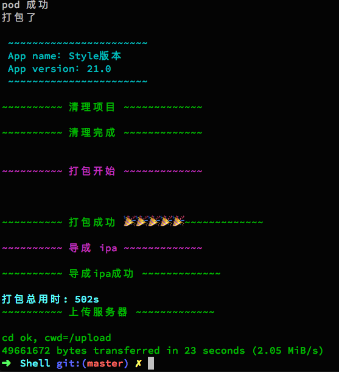

## 自动打包
此脚本完成从服务器下发打包任务，然后打包完成上传至服务器的过程
针对 ADHoc 方式的手动设置打包过程
步骤如下：
1. 拉取图片（可选）
2. 使用脚本创建对应的AppIcon（可选）
3. 根据给定的名称来组合Git地址
4. Git Clone
5. 如果有图片需要替换AppIcon，就去替换AppIcon
6. pod repo update && Pod Update
7. 打包
    * 得到一个显示名称
    * 设置 project.pbxproj 里面参数(PRODUCT_BUNDLE_IDENTIFIER，CODE_SIGN_STYLE，ProvisioningStyle，DEVELOPMENT_TEAM)
    * 设置 info.plist 中的显示名称，以及 CFBundleIdentifier
    * xcodebuild clean -workspace (清理)
    * xcodebuild archive -workspace (打包)
    * xcodebuild  -exportArchive（导出）
8. 上传到服务器

